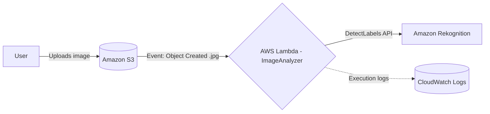

# Serverless AI Image Recognition System

An event-driven, serverless pipeline on AWS that automatically analyzes uploaded images using AI-based object detection — with zero server management.

## Overview

**Goal:** Build a fully automated, event-driven system to analyze image content.

**Objectives:**
- Demonstrate interconnection between multiple AWS services
- Implement a serverless architecture for high scalability
- Use AI (Amazon Rekognition) for object detection

## System Architecture



**Workflow:**

1. **Storage** — User uploads an image to an Amazon S3 bucket.
2. **Event Trigger** — S3 emits an `ObjectCreated` event that invokes an AWS Lambda function.
3. **Compute** — The Lambda function runs a Python script to process the uploaded image.
4. **AI Analysis** — Lambda calls the Amazon Rekognition `DetectLabels` API to identify objects in the image and logs the results to CloudWatch.

## Tech Stack

| Layer | Service |
|---|---|
| Storage | Amazon S3 |
| Compute | AWS Lambda (Python) |
| AI / ML | Amazon Rekognition (DetectLabels) |
| Monitoring | Amazon CloudWatch Logs |

## Why Serverless?

- **Automatic Scaling** — Handles 1 or 1,000 images simultaneously without manual intervention.
- **Cost-Efficient** — Pay-per-request; you only pay when the code actually runs.
- **No Infrastructure Management** — No servers to provision, patch, or maintain.

## Implementation & Results

- **Interconnection Success** — S3 and Lambda are successfully connected via event triggers.
- **Execution Logs** — CloudWatch confirms the function is triggered in real time on every upload.
- **Note on Environment** — The `AccessDenied` entries seen in the logs come from AWS Academy Lab Policy restrictions on Rekognition API calls in the training sandbox; the core architecture and event wiring are fully functional.

## Project Structure

```
.
├── README.md
└── lambda_function.py   # Lambda handler — triggered by S3 upload, calls Rekognition DetectLabels
```


## Conclusion

The project demonstrates a scalable, serverless solution for image processing, and shows the ability to architect a complete cloud workflow using AWS managed services.

## Author

**Nourhan Hamdy** — Computer Engineer
